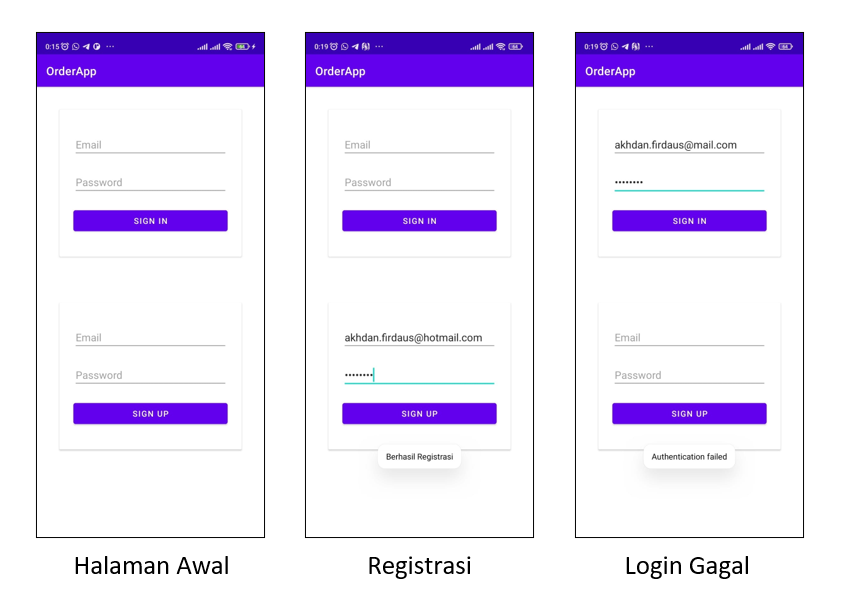
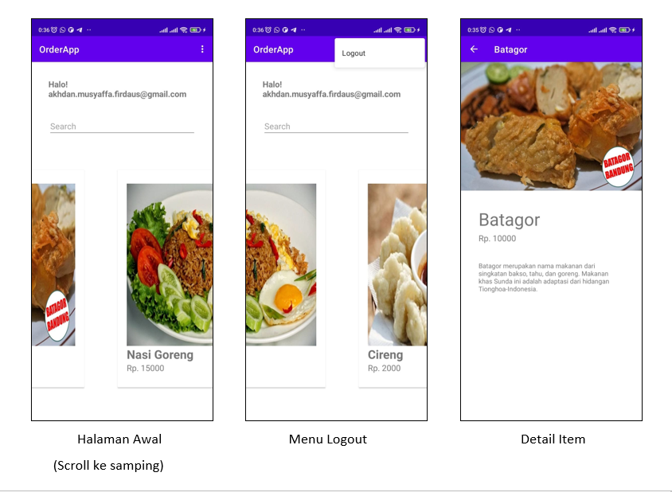

# order-app
Source Code Aplikasi Menu UTS dan UAS PPAM

Dibuat oleh Akhdan Musyaffa F (1197050010)

# PPAM-B, Informatika UIN Sunan Gunung Djati Bandung
### Mata Kuliah Praktikum Pemrograman Aplikasi Mobile
### Dosen Pengampu : Aldy Rialdy Atmadja, MT.

##Fitur
1. Login dan Register menggunakan Firebase Auth
2. Menampilkan data dari database SQLite
3. Menampilkan menu
4. Menampilkan halaman detail

##Halaman Login dan Pendaftaran

##Hasil Awal dan Detail

